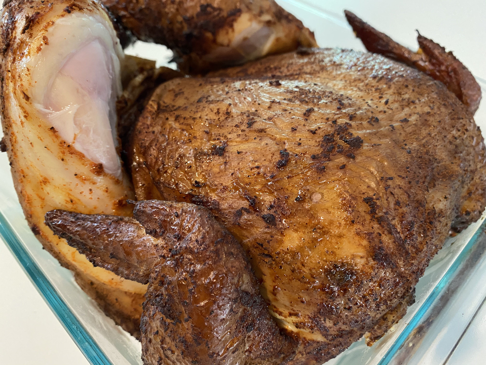
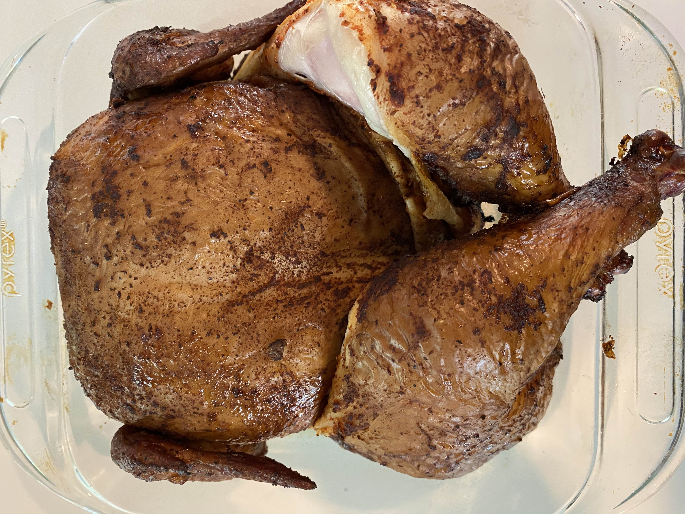
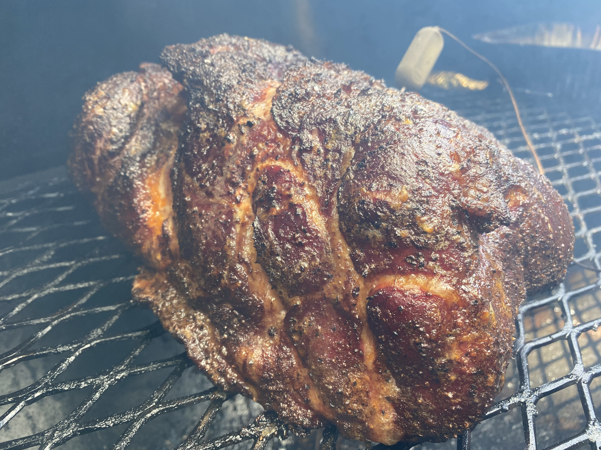

# may 21, 2020 - memorial day cook

this is far from my first cook, but i finally decided to document these cooks.  additionally, a purchased a new cooker a few weeks ago and am now testing it out.  the cooker i bought is an `old country pecos smoker`.  in my opinion, it is the best mass-produced unit for the price.  i'm pretty happy with it.

### meat:
- pork boston butt, 
- whole roasting chicken

### wood:
- pecan

### start time: 
- 9:00am est

---

#### pork rub: 
- 2 tbs coarse ground pepper
- 2 tbs kosher salt
- 1 tsp onion powder
- 1 tsp garlic powder
- 1 tbs paprika

#### chicken rub:
- store-bought gift from my friend AJ
- dancing pigs: original dry seasoning

---

### the cook

The kids slept in today for the first time in a while, they usually wake us around 7:30 if we are not up first.  Today I didn't get going until after 8am.  We were expecting to leave the house (taking the food to Sarah's brother's house) around 4 - so this was going to be a tight timeline of a cook.  

I started the fire with a chimney of charcoal and put on two pecan logs, then filled the water pan.  I let the cooker heat a bit before I put on the pork, and it was around 350 degrees. For the most part, this cooker runs about 30-50 degrees cooler than my last rig.  After the first logs burned down for about an hour, I moved the coals around and added a log.  The temperature was around 300 then rapidly spiked to approximately 350-375.  On the next two feeds, I would wait longer to add the new wood, which resulted in a more consistent temperature; however, the temp only heald around 45 minutes.  On the last feed of the day, I added 2 logs, but this caused the temperature to spike to about 425 degrees.   I need to get better at fire management on this cooker.

### pictures

|  |  |  | 
|:-------------------------:|:-------------------------:|:-------------------------:|
|   |  |   |
|   | | |
