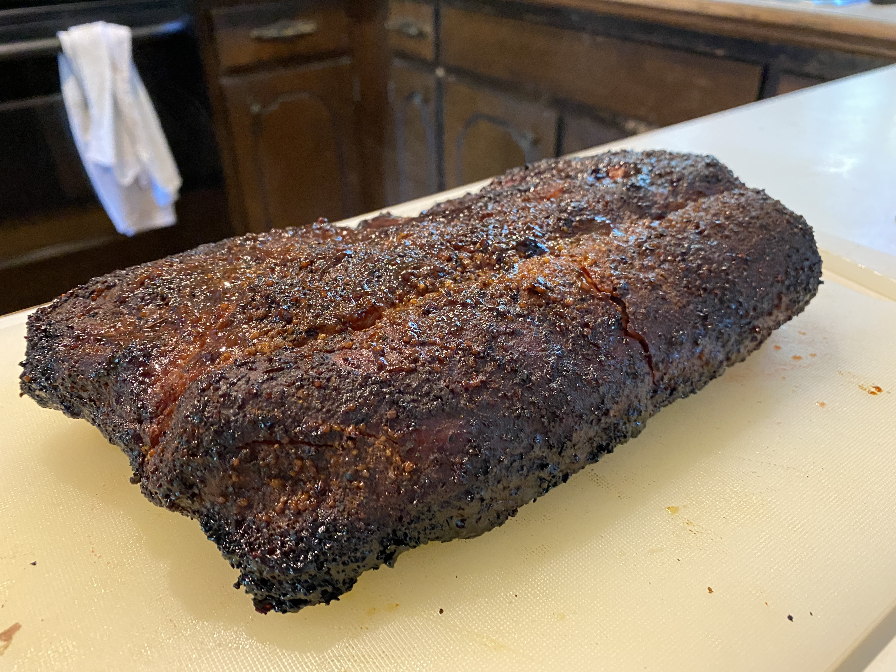
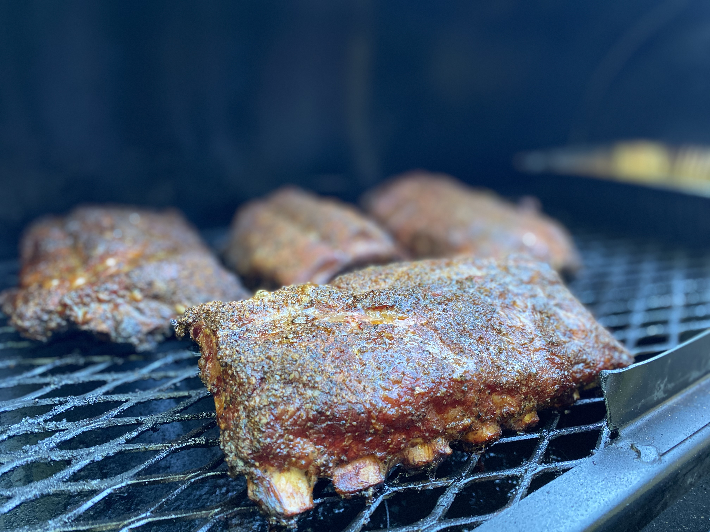
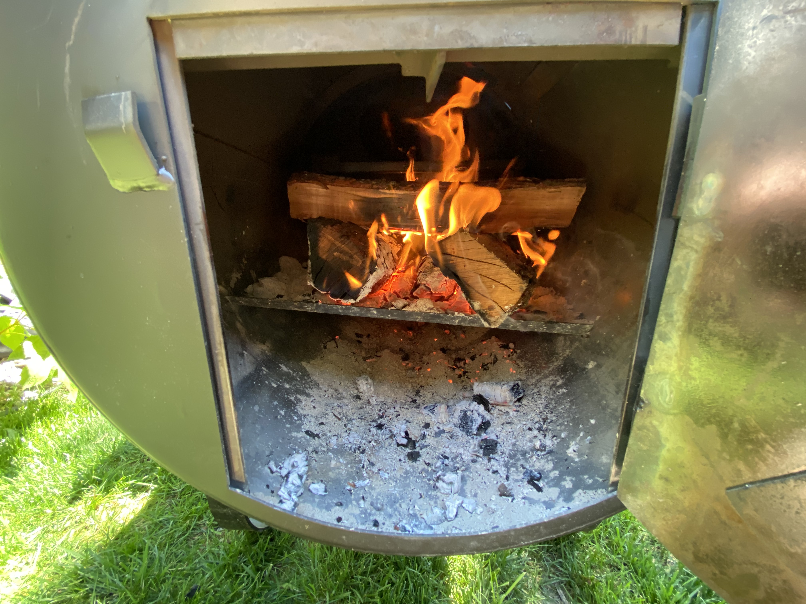
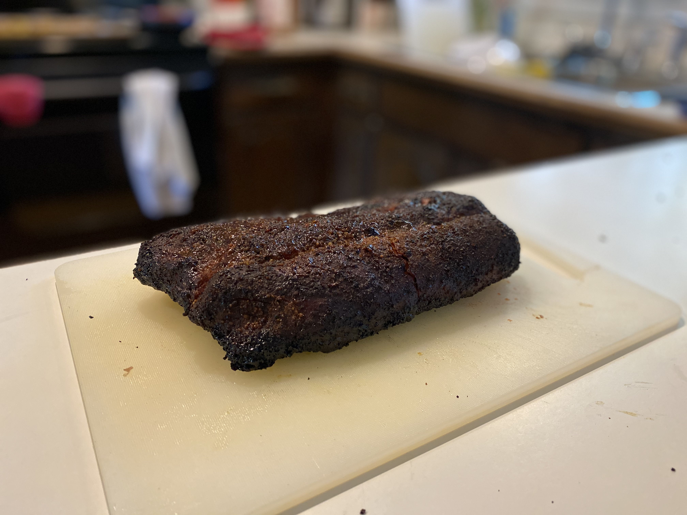

# may 31, 2020 - ribs for the family

we had two racks of ribs haningout in the freezer and meat prices are a bit high, so we decied go break these out :).  the boys are excited about dinner tonight consequently.

### meat:
- 2 racks baby back ribs

### wood:
- Cherry

### start time:
- 1:45 pm est

---

#### pork rub:
- 2 tbs coarse ground pepper
- 1 tbs kosher salt
- 1 tsp onion powder
- 1 tsp garlic powder
- 1 tbs paprika

---

### pictures

|  |  |  |
|:-------------------------:|:-------------------------:|:-------------------------:|
|   |  |  |
